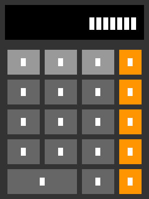

# 计算器

一个简洁美观的 Python GUI 计算器，使用 tkinter 构建。

## 功能特性

- ✅ 基础四则运算（加、减、乘、除）
- ✅ 键盘输入支持（数字、运算符、回车计算）
- ✅ 清除功能（C键、ESC键）
- ✅ 正负号切换（±）
- ✅ 百分比计算（%）
- ✅ 简洁的界面设计

## 运行要求

- Python 3.6+
- tkinter（Python 标准库）

## 安装运行

```bash
# 克隆仓库
git clone https://github.com/你的用户名/calculator.git
cd calculator

# 运行程序
python calculator.py
```

## 使用说明

### 界面操作
- 点击数字按钮输入数字
- 点击运算符进行计算
- 点击 `=` 或按 `Enter` 查看结果
- 点击 `C` 或按 `ESC` 清除

### 键盘快捷键
| 按键 | 功能 |
|------|------|
| 0-9 | 输入数字 |
| + - * / | 运算符 |
| Enter | 计算结果 |
| ESC | 清除 |
| Backspace | 删除最后一位 |

## 截图



## 技术栈

- Python 3
- tkinter（GUI 框架）

## 作者

K

## 许可证

MIT License
